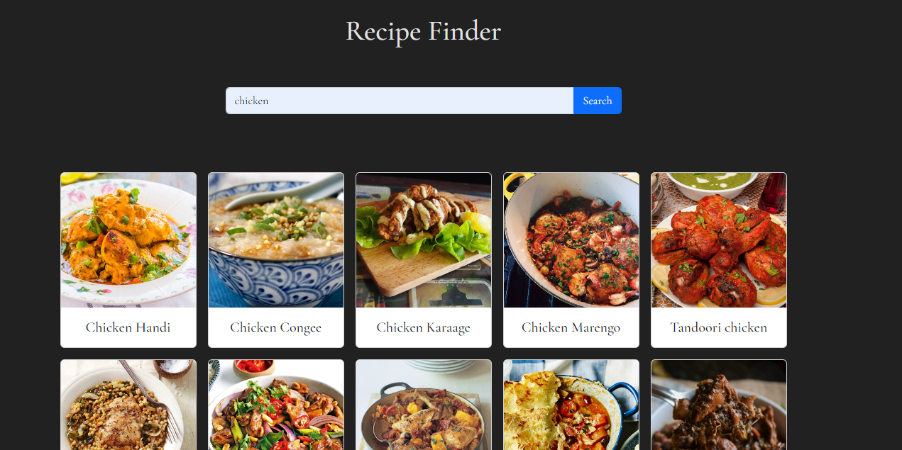

# Recipe Finder

## Overview

Recipe Finder is a web application that allows users to search for various meal recipes. Users can input the name of a meal they are interested in, and the application will fetch relevant recipes from an external API. Users can then view details of each recipe, including ingredients and cooking instructions.

## Features

- **Search Functionality**: Users can search for meal recipes by entering the name of the meal they want to cook.
- **Recipe Display**: The application displays the search results as cards containing images and names of the meals.
- **Recipe Details**: Users can click on a recipe card to view detailed information about the selected recipe, including ingredients and cooking instructions.

## Technologies Used

- **HTML5**: Markup language for structuring the web page.
- **CSS3**: Styling language for enhancing the visual appearance of the web page.
- **JavaScript (Vanilla)**: Programming language for implementing dynamic behavior and interactions.
- **Bootstrap**: Front-end framework for building responsive and mobile-first websites.
- **API Integration**: Utilizes the MealDB API to fetch meal data.

## Usage

1. Clone the repository to your local machine.
2. Open the `index.html` file in a web browser.
3. Enter the name of the meal you want to search for in the provided input field.
4. Click the "Search" button.
5. View the search results displayed as cards.
6. Click on a card to view detailed information about the selected recipe.

## Screenshot

Add a screenshot of your application here -->

## Credits

- **MealDB API**: Provides the database of meal recipes used in the application.
- **Bootstrap**: Used for styling and layout components.

## License

This project is licensed under the [MIT License](LICENSE).
